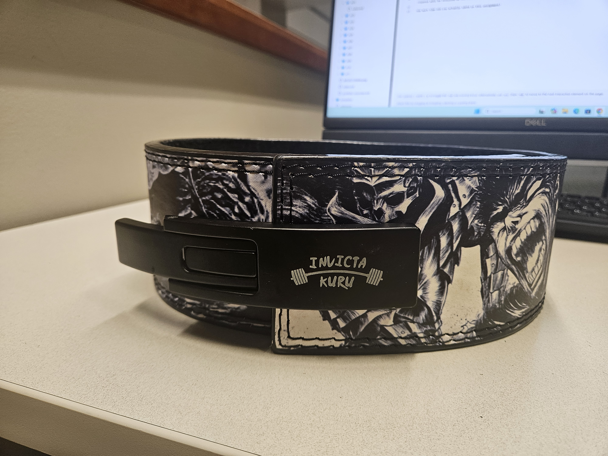
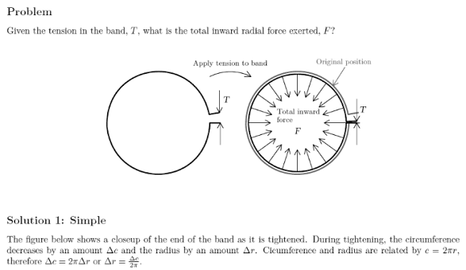
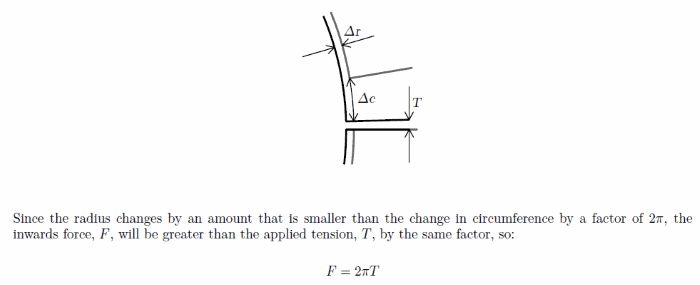
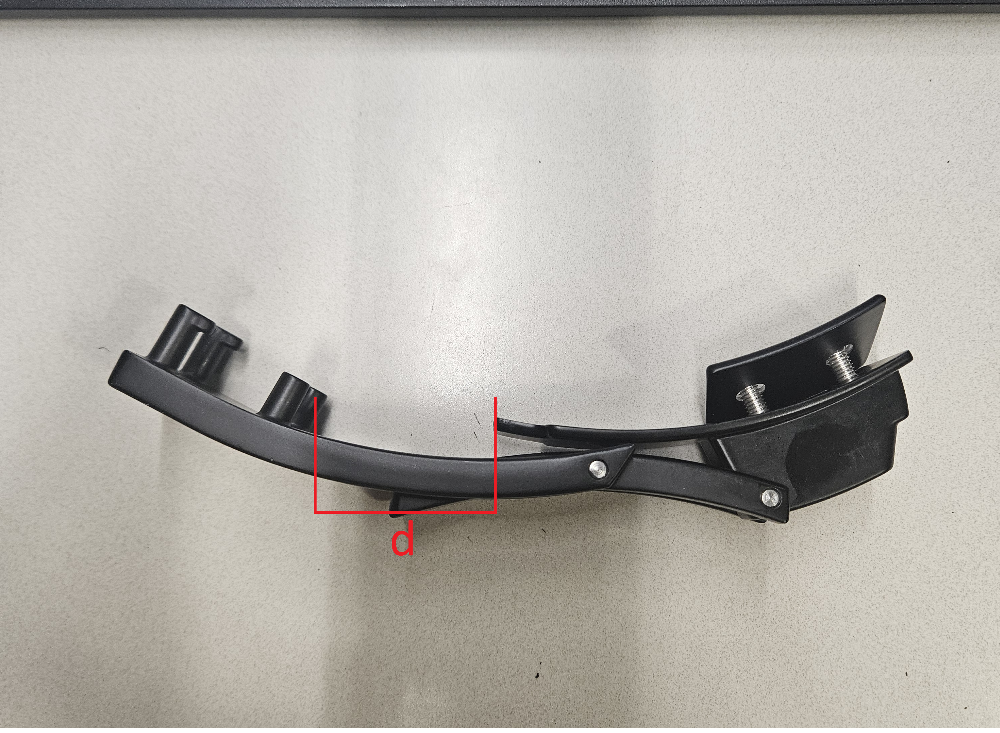
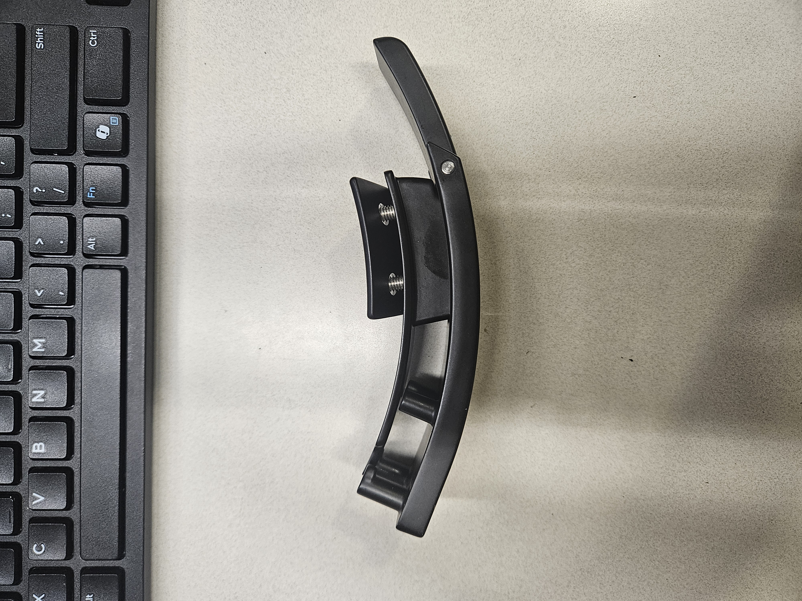

# A1 – [Create Portfolio]

## Objective
Set up Your own Portfolio

## Analyze
Part A: Portfolio Analysis
https://nhoong.github.io/
Engineering Portfolio: Nathan Hoong

Navigability:
Nathan Hoong's portfolio is easy for readers to navigate. All of Hoong's works can be found in under 60 seconds just by scrolling down the portfolio section of the website. Hoong

Reproducibility:
Hoong's portfolio does not contain enough documentation to reproduce his work. In all of Hoong's work, he provides only images with descriptions of the objective and results. However, Hoong's capstone project has a report that makes it easy to reproduce his project.

Evidence of reasoning:
Hoong shows his evidence of reasoning through the images he posts and the description of each work's objective. Hoong does not provide much detail about his capstone project and only provides descriptions of his objectives.

Professional Tone:
In Hoong's about me section and the objectives and results of his work, he maintains a professional tone.

Engineering Portfolio: Armstead Capehart
https://uncc.instructure.com/eportfolios/2820/Sophomore_Design_Project_Part_1

Navigability:
Capehart's portfolio is easy to navigate. All of Capehart's work can be found in under 60 seconds through the different pages he has under the sections column. All of Capehart's works are clearly labelled and are organized from earliest to latest, making it easy for readers to find.

Reproducibility:
Capehart's documents all of his works properly. Capehart documents his sophomore design project from start to finish and provides sketches and CAD models of his project. However, Capehart does not provide enough documentation to fully reproduce his work.

Evidence of reasoning:
Capehart's documentation of the process of designing and making demonstrates strong evidence of reasoning. Under each section of the different parts of the project, Capehart follows the same format of reasoning through his purpose and problem statements and his sketches and CAD models.  

Professional Tone:
Capehart demonstrates professional tone throughout his portfolio through his concise statements.

Task B:  Product Analysis

The primary function of the lifting belt is to act as apply force around the inner circumference of the belt by decreasing the radius of the belt.

b.  Identify the governing model : what equation or physical principle governs its primary behavior?

The force that is applied by can be roughly calculated and explained using the equation and diagram below.

The variables of this equation would be the radius of the belt and the tension applied by the clasp.
One assumption that would make the model work is that the radius of the belt shrinks equally around the belt.

In the belts open position the radius of the belt is larger than needed in order to wrap around the subject before applying force.

In the belt buckles open position we can see that the distance between plate of the anchored end and the additional posts of the hooks allow for the belt to have a larger radius.

In the belt buckles closed position the distance between the plate of anchor and the additional posts of the hooks have decreased and are now over lapping decreasing the belts radius.

When the belt buckle is engaged the radius of the belt decreases applying force along the inner circumference of the belt.

  The mechanism for this weight lifting belt was published September 17 1985 under patent #US4541152A authored by Thomas J. DiMarco and Joel E. Di Marco.
i. two alternative solutions or devices that solve the same primary function.
  Two alternative solutions would be a lifting belt with the traditional belt buckle and two prongs and rows of holes or ratchet based belt where the free end of the belt feeds into a linear ratchet that can be released.
  
ii. one design decision the original engineer made : something you can see in the patent or geometry : and explain why you think they made that choice.
  The design decision for the lever engaging belt buckle was made so that users could quickly engage and disengage the belt.

## Decide

Template Change:
Changed the primary color of the palette from green to black and removed the banner image to give the portfolio a professional look. Change was implemented because template default was not catered towards employers.

Your Documentation Standard : 
All documentation for each assignment will be thoroughly detailed and easy to follow. 

## Communicate
Your portfolio template includes a labeled "About Me" section on the homepage. Populate it directly in that section of your MkDocs site : do not create a separate page. Answer the following in paragraph form. Do not provide answers in question-and-answer format.

1.  Your first and last name.

2.  Write a professional introduction (~300 words). Who are you as an engineer? What brought you to mechanical engineering? What kind of engineer are you becoming? This is not a biography : it is a professional statement. It should read like something you would hand to a hiring manager, not something you would post on social media.

3.  Answer this question directly, in a clearly labeled paragraph: "What does it mean to defend an engineering decision : and do you currently know how to do it?" Answer honestly. There is no correct answer at Week 1. This response will be revisited at the end of the semester. Students who engage with it seriously at the start will have the most to learn from the comparison.

4.  How much time did you actually spend on this assignment?

