# A2 – Truss Stress Analysis

## Objective
- Design a lightweight planar truss using A500 steel or an alternative material.
- Create free body diagrams (FBDs) for joints and critical pins.
- Calculate the required cross-sectional area of truss elements with a safety factor.
- Determine pin sizes based on shear forces with a safety factor.
- Solve equations symbolically and numerically for both truss and pin design.
- Estimate the total weight of the truss and pins.
- Create a CAD model with accurate dimensions and connections.
- Compare CAD weight predictions with hand calculations.
- Document key engineering lessons learned from the process.

## Analyze

The initial research for this truss analysis started with looking at the diagram given and finding out the material properties of A500 steel. Due to having a late start to this assignment, I did not spend much time analyzing the situation and went with the first design that came to my mind. I placed a point in the middle of the top member and connected points D and C to it, labeling it point E.

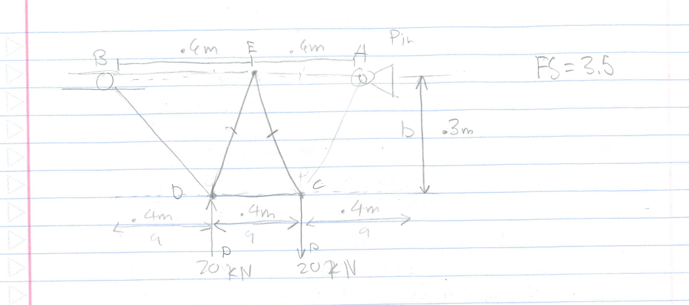

Then, through Google, I found a document provided by Eagle Steel with the yield strength, density, and bulk modulus of ASTM A500 Grade B steel.

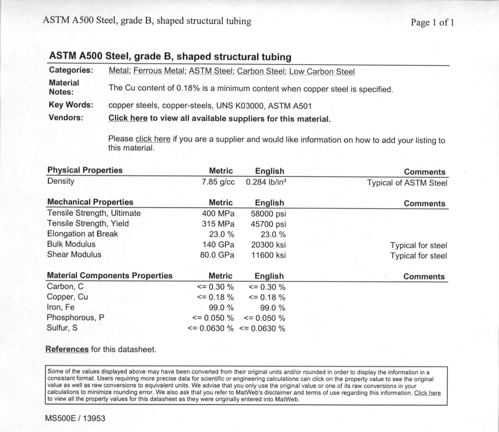

### Internal Forces 
  I analyzed the internal forces experienced by each member through the method of joints. I chose to use the method of joints because calculating each joint on a small truss would not be that difficult. To make it easier to write out the equations, I used the ratio of each respective side to the hypotenuse.
  
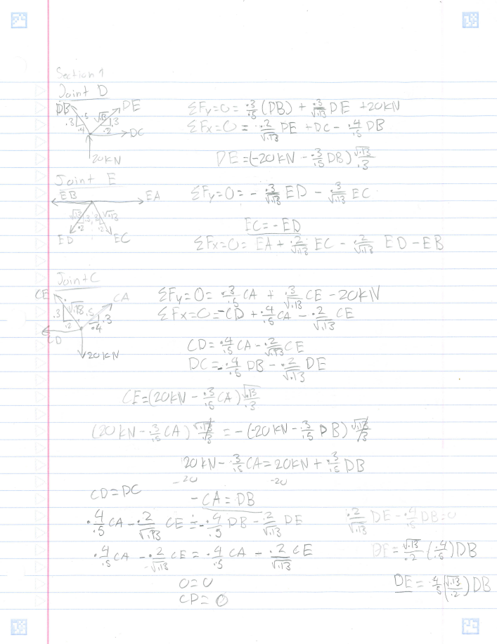

I chose to start at the joints with a load to see if I could find my first internal force. I then moved to joint E to make a relationship between joint D and C through member EC and ED. Using the relationship between ED and EC and the equations for CD from joints C and D, I was able to find my next relationship between CA and DB. Using the CD equations, the CA and DB relationship, and the EC and ED relationship I found that member CD was a zero-force member. Next, I set up the equations for joints A and B to find the remaining equations before solving numerically.

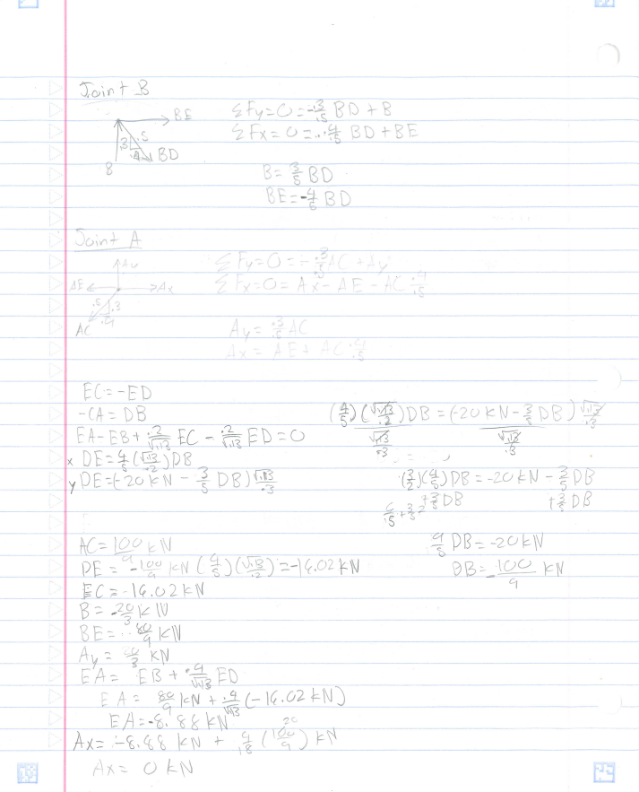

After finding the equations for Joints A and B, I rewrote all the relations and equations found earlier to solve them all numerically. I chose to organize the equations like this to make it easier to show how I solved for forces symbolically before numerically and to make it easier to scan and upload

To make sure I had calculated my internal forces correctly, I used an online truss analysis calculator to compare to mine.
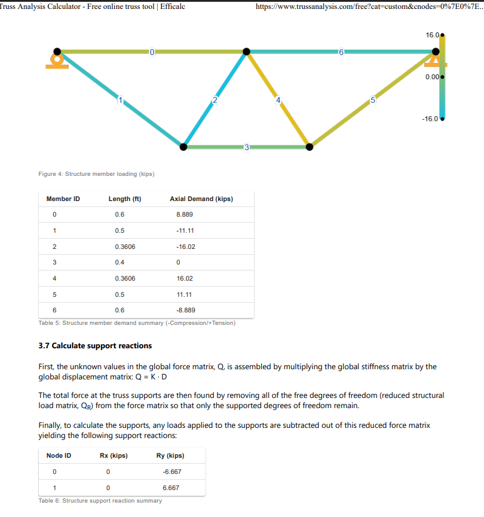

### Cross-Sectional Areas & Mass
To find the cross-sectional area of each member, I used the largest internal force experienced by the truss. By using the largest internal force, we could find the minimum thickness required for each member.

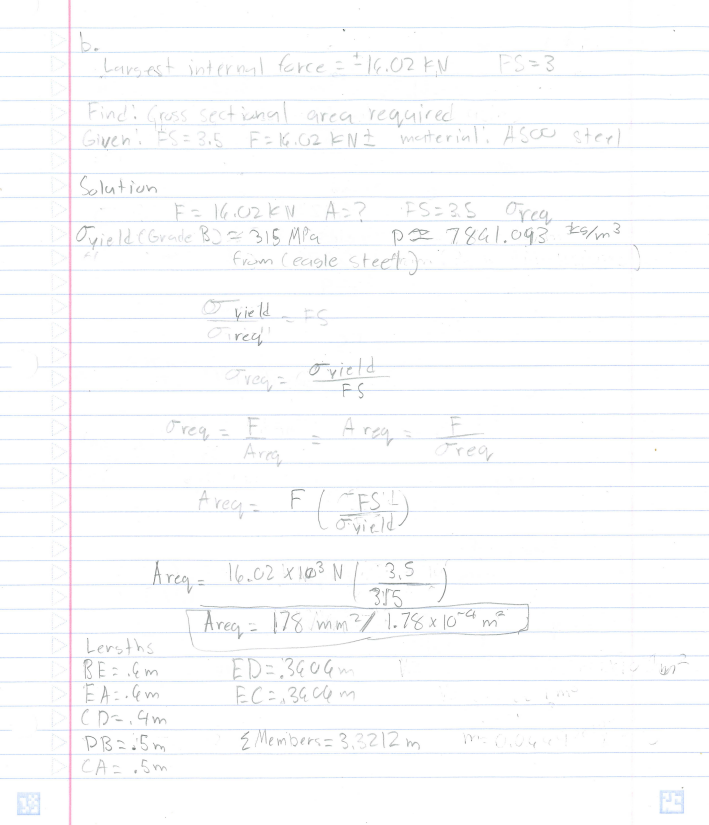

In order to calculate the total mass of members, I summed the lengths of each member and multiplied it by the cross-sectional area and density of the material.

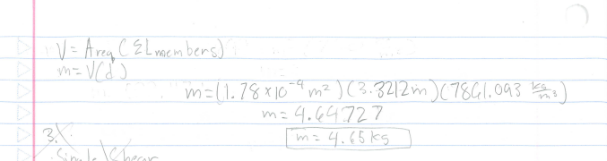

Calculating the cross-sectional area required for the pins first required me to do first do an FBD. I chose joint D to analyze because it experiences the greatest force from the load. 

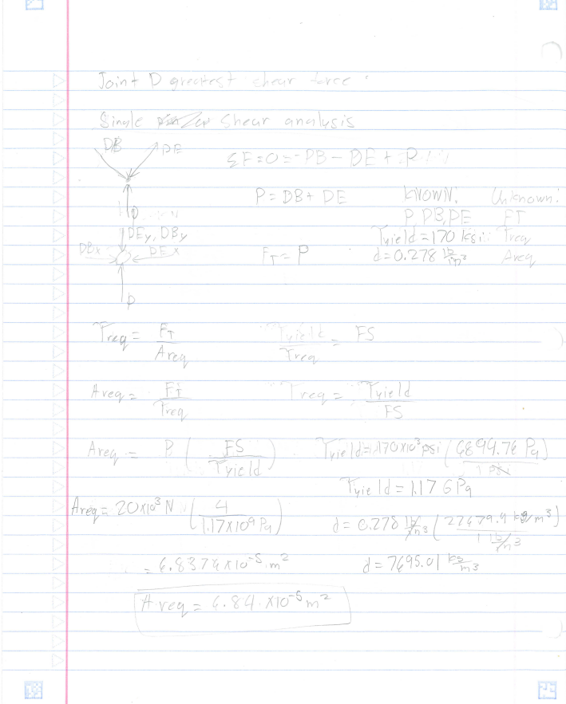

To model the pins in SolidWorks, I also calculated the radius and the diameter of the pins. In order to calculate the mass of the pins, I had to find the dimensions of the cross-sectional area for the members. To make this truss a single part, I chose to make the members 0.5mm shorter than the pin diameter. With this constraint, I determined the truss depth and used it as the pin length and the dimension of the CAD model.

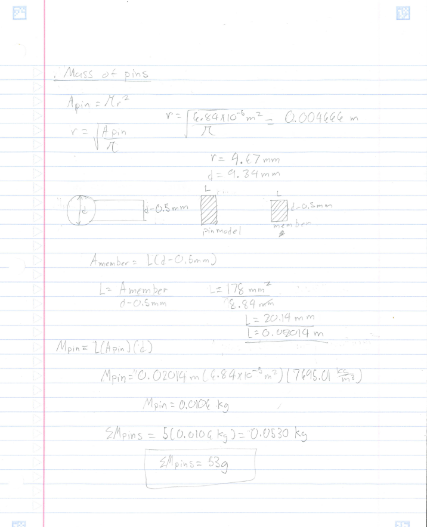

Summing both  the mass of the pins and the mass of each member:
#### 4647.27 g + 0.053 g = 4647.323 g = 4.65 kg

### CAD Model
To model the truss in SolidWorks, I started by setting up construction lines with the same dimensions as seen in the initial sketch.
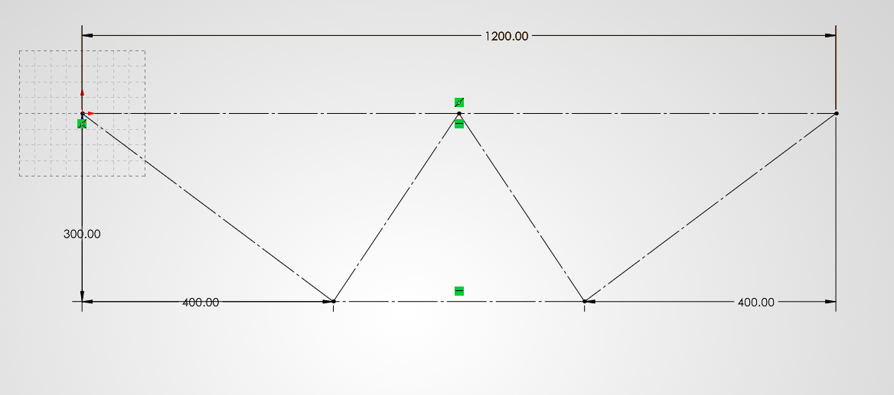
Then, after setting up the construction lines, I created the pins using the circle tool around all the joints of the truss. I followed up by using the offset tool on the construction lines and set them to 0.25mm less than the radius of the tool. Then I used the trim tool to trim all lines to create one profile.
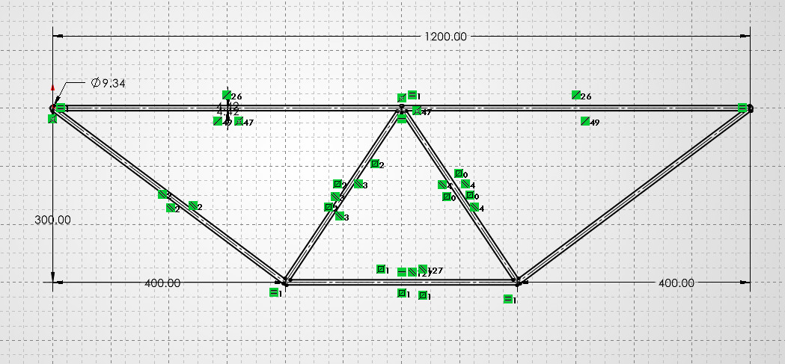
Finally, I used the extrude command and set the length to 20.14 mm, from the calculation I had done earlier.
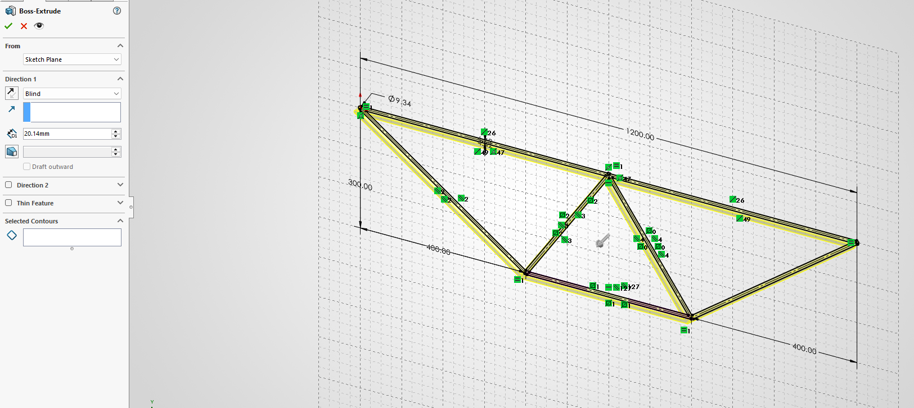
The final CAD model ended up with small radii around each joint. Before I could find the mass of the model in SolidWorks, I first had to create a profile for the A500 from the document of Eagle Steel.
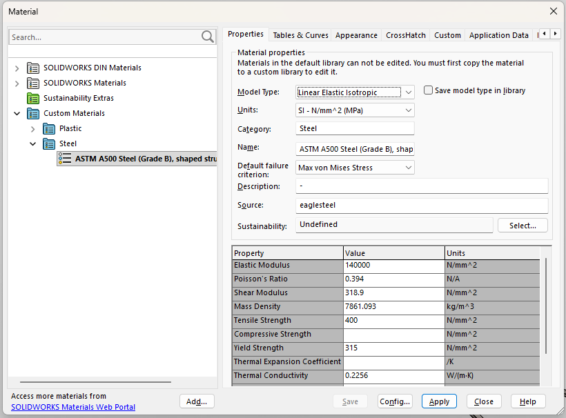
After creating the material, the mass of the entire truss was 4606.52 g. 
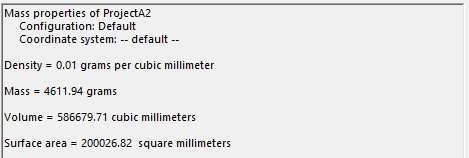
Comparing the mass of the truss I got from calculations to the CAD model of it there is only a
#### 100 x ((4647.323-4605.52) / 4606.52 ) = 0.910 percent error

The link to the CAD file is at the bottom of this page.

### Part 1 – Truss Members

Looking at the truss analysis document, we can see that members BE, EC, and CA(0, 4, and 5) are under tension and members BD, DE, and EA (1, 2, and 6) are under compression. However, member 3 (DC) is the only zero-force member and would not fail under load. Members BE, EC, and CA would fail through yielding before they fracture. Members BD, DE, and EA would fail under buckling. According to the document attached, Grade B ASTM A500 Steel has a carbon content less than or equal to 0.30%, making it more ductile.

According to the document from Eagle Steel, the yield strength of each member is 315 MPa. For members under tension, the largest amount of normal stress experienced is 90 MPa. With my current model, all members under compression would buckle under load. Using Euler's buckling formula, members BD, DE, and EA have critical loads of 6.41 kN, 12.3 kN, and 4.450 respectively. All of which are well below the loads they experience, according to my analysis.

Propose a design modification that could reduce the likelihood of this failure.
In order to prevent each member from failing due to buckling, I would change the cross-sectional area to a square with a length of 13.34 to increase the critical load on the smallest member to 14.6 kN.

### Part 2 – Pin Connections

In order to figure this out I compared the shear capacity of the pin to the bearing capacity of the member. I used the equations for calculating bolt capacity and bearing capacity from the video linked below.

From the calculations the pins have a lower capacity of 48 kN compared to the bearing capacity of  59.2 kN. Using the NDS yield modes the pin would fail in mode 1 where the capacity of the bearing is greater than the capacity of the pin. In order to reduce the likelihood of this mode of failure I would increase the diameter of the pins.

https://www.structuremag.org/article/design-of-bolted-connections-per-the-2015-nds/

## Decide

For my truss geometry I tried to make it similar to the roof of a truss. Because of my late start to this project I chose only to put an additional joint at the mid point between points A and B and connect it to joints C and D. I had chosen this simple geometry, in order to make my hand calculations easier and shorter so I could finish the project before the deadline.

For the Cross sectional area I chose to make the thickness of the members 0.5mm less than the diameter of the pins. I chose to do this in order to make modeling the truss as one part easier.

## Communicate

#### Links used:
Truss Analysis Calculator: https://www.trussanalysis.com/free?cat=custom&cnodes=0%7E0%7Er%7E0%7E0_1.2%7E0%7Ep%7E0%7E0_0.4%7E-0.3%7Ef%7E0%7E-20_0.8%7E-0.3%7Ef%7E0%7E20_0.6%7E0%7Ef%7E0%7E0&cmems=0%7E4%7E178%7E140000_0%7E2%7E178%7E140000_2%7E4%7E178%7E140000_2%7E3%7E178%7E140000_3%7E4%7E178%7E140000_3%7E1%7E178%7E140000_1%7E4%7E178%7E140000

Calculating Bolt Capacity Video: https://youtu.be/VHd_eSXwbIc.

Link to CAD model: https://drive.google.com/file/d/1iw-bSKslxPwRai5A2qfZOkWMZSBFgW36/view?usp=drive_link

