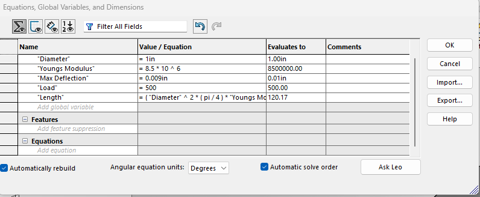
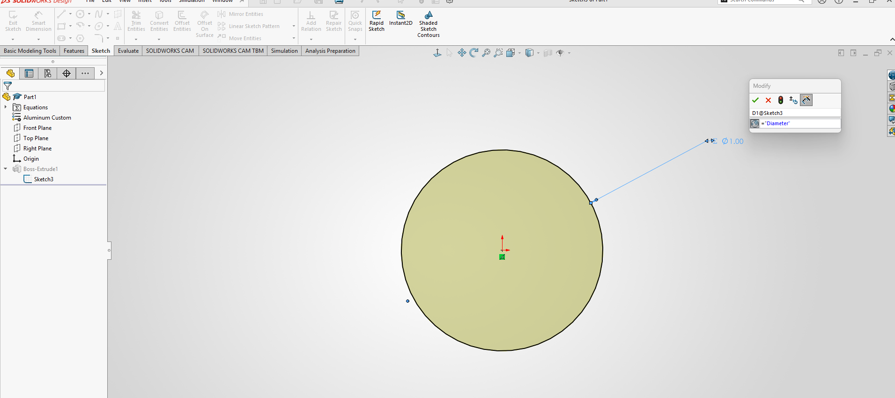
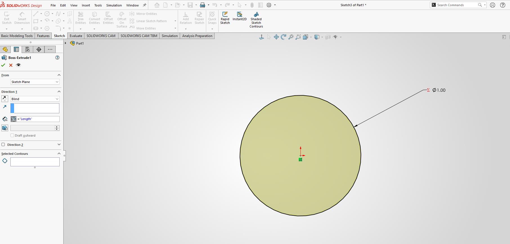
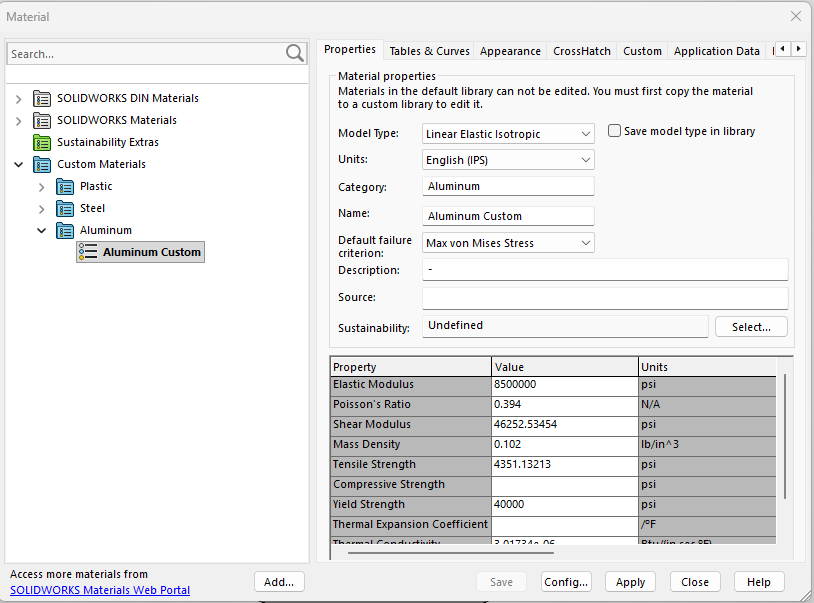
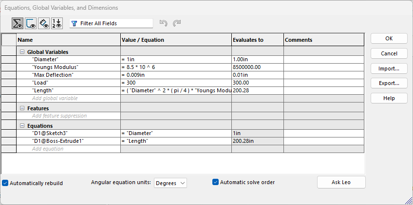
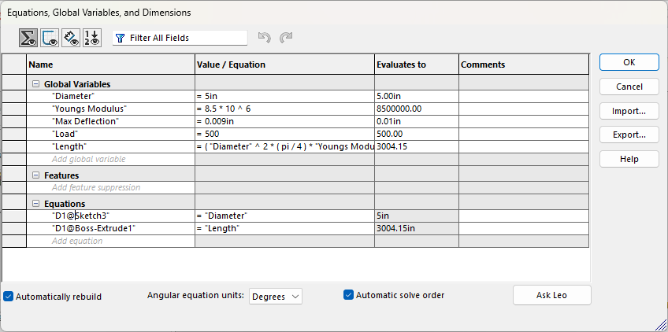

# A3 – [Topic]

## Objective
- Use axial deflection modeling to design its dimensions
- Use parametric design to determine a bars length
- Introduce you to FEA (Finite Element Analysis)
- Introduce you to linking dimensions to appropriate parameters in CAD.
- Compare and contrast the different analysis

## Analyze
Before starting anything, the first thing I did was watch the two videos attached to the assignment on parametric design and how to conduct an FEA in SolidWorks. To calculate for the length of the shaft I solved for L from the direct tension deflection relationship. 

### Hand Calculations
![image of hand calculations of relationship]
After solving symbolically, I moved on to calculating the minimum and maximum length for a rod given a 1 in diameter with the specified values for F and the Elastic Modulus. For the design I chose to go with the minimal Length I had calculated and used the appropriate Young's modulus of 8.5*10^6 psi and a force of 500 lbs.

![image of calculating min and max length]

### CAD Modeling and FEA

Then I went into SolidWorks, and before sketching anything, I went into the equations folder to create variables for the diameter, force, Young's modulus, and maximum deflection and assigned them their respective values. The Length variable was assigned the Length equation that was calculated earlier. 

Then created a sketch of a circle and assigned the diameter variable to the circle's diameter. 

Then I used the extrude tool and set the length to the length variable I set earlier.

Before I could run the FEA, I first had to create a custom aluminum material that matched my original parameters. I had opted to only assign my chosen values to yield strength and shear modulus and left all other variables assigned to their default values.

### Modify Design Parameters

#### Decreased Load
The first parameter I modified was the load applied to the rod, and I decreased it from 500 to 300 lbs and kept the 1 in diameter. Looking at our Length equation, we can see that a smaller load would contribute to a longer length of the rod. A smaller stress applied to the rod would require a smaller strain, which would increase the Length given that we kept our deflection the same.

#### Increased Diameter 
Similar to the first answer, an increased diameter would increase the length of the rod because a smaller stress would require a smaller strain and therefore an increased length. 

## Decide

From the FEA done on the part, the displacement is 9.017*10^-3 in. The percent difference between the given max deflection and the deflection given by the FEA is around 0.18 %.

If there is a meaningful discrepancy, identify at least one likely source (e.g., assumptions in the hand-calc, boundary conditions, mesh density, material property inputs).
If the two values are essentially the same, explain why you'd expect them to agree for this geometry and loading (e.g., no stress concentrations, simple axial loading, coarse mesh still adequate for a uniform 
Either way, state which result you'd trust more for this design and why.
I think the values of the deflection are essentially the same, because of the simple axial loading, lack of stress concentrations, and the material properties and constraints. The simple axial loading and lack of stress leads to a simpler design

(5%) Now imagine a fairly substantial pin hole on the left side of the bar. Look up the stress concentration factor (Kt) for a hole in a flat bar in tension (Peterson's charts or Machinery's Handbook). Using your FEA's nominal stress away from the hole, estimate the peak stress at the hole and state whether it would still pass your safety factor. (Don’t redo the FEA!)
(5%) Lessons Learned document mistakes made and actual time spent from start to finish.

## Communicate 
