# A4 – [Motor Mount]

## Objective

Design a motor mount using the (Brushed 24V DC Gear Motor 3.6Kg.cm/46RPM w/ 99.5:1 Planetary Gearbox) HERE which attaches to the rigid wall A. For both features, first design for yield strength and then design for a maximum deflection of .30 mm at the free end. You may select ABS, PETG,  or PLA as a motor mount material. 

## Analyze

### Research
Before designing this mount, I did some initial research into what design considerations I should have when designing motor mounts by looking at the article linked at the bottom of the page. Looking at all the references and the materials we could make this mount from, I also looked at an article about designing 3d printed motor mounts specifically. The article is linked below. To make the model more accurate, I ignored the instruction to exclude the motor's mass and calculated all values using the motor's mass. I modeled the mass of the motor as a distributed load the size of its largest diameter, given from the drawing provided by the website. I chose ABS as my material for the mount.

In my initial sketch of the design, I decided that the mount would be 30mm wide and calculated for the thickness of the mount in all stress and deflection calculations. For all calculations, a factor of safety of 3 was used. 

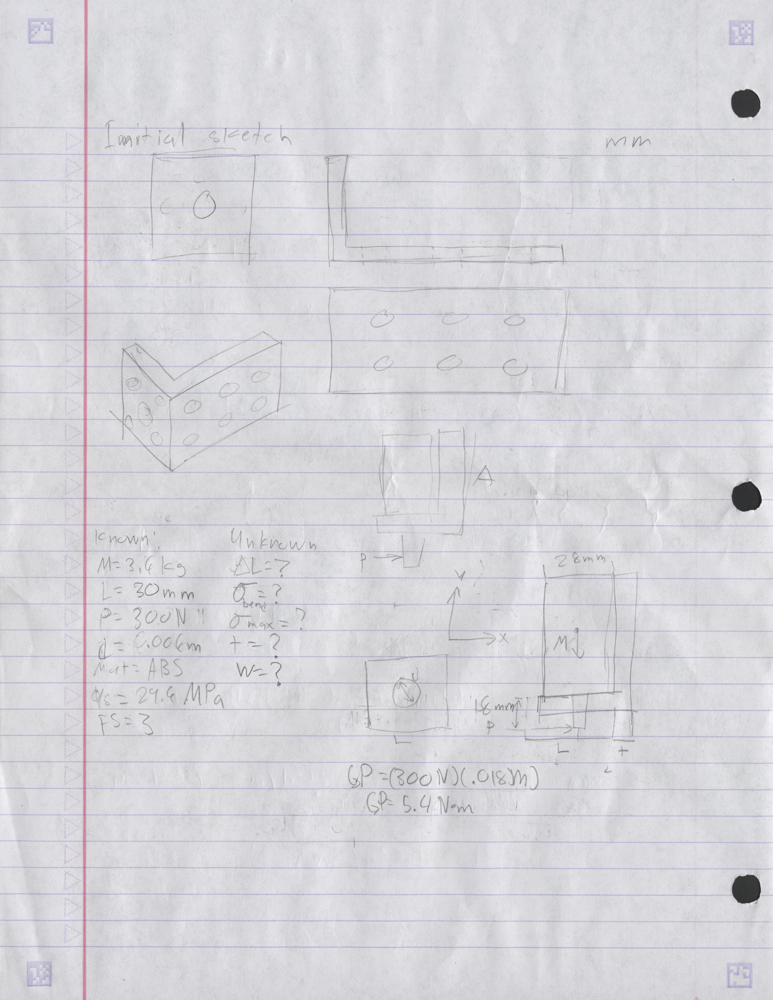

### Feature 1

My first calculations were done to find the thickness with respect to the yield strength of ABS. As a challenge, I decided to try to accurately determine the thickness of feature 1 by treating the feature as a rectangular plate with a transverse hole in it. I used the chart below to find the stress concentration factor. The size of the hole was set to 18.3mm.

Then I calculated the thickness of feature 1 to minimize the deflection to a minimum of 0.00030mm.

Because the thickness of feature 1 that minimizes deflection is larger than the thickness that can handle the yield strength of the mount. The final thickness of feature 1 was set to be 13.1 mm.

### Feature 2

When calculating the thickness of the mount with respect to yield strength, feature 2 was modeled as a cantilever beam with a moment at the end. The same 30 mm width of the mount was used in all calculations. For feature 2, when calculating with respect to yield strength, only the bending stress of a cantilever beam was used in the calculations.

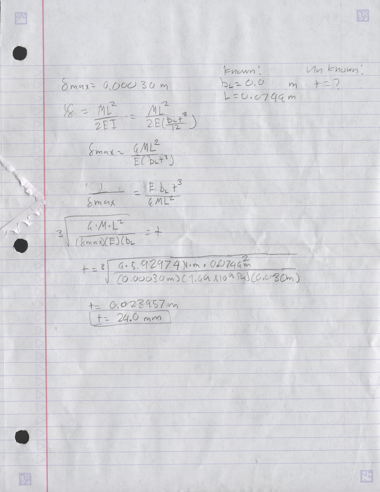

Same with feature 1: the thickness of feature 2, when calculated, trying to minimize deflection could also handle the yield strength of the mount. The final thickness of feature 2 was set to 24.0 mm.

### Final Sketch

The final design of the mount was drawn according to the thicknesses calculated. The length of feature 1 was set to 30 mm, and the length of feature 2 was set to the length of the mount. In feature 1, I placed a counterbore for the 2 mm offset that is on the face of the axle side of the motor.

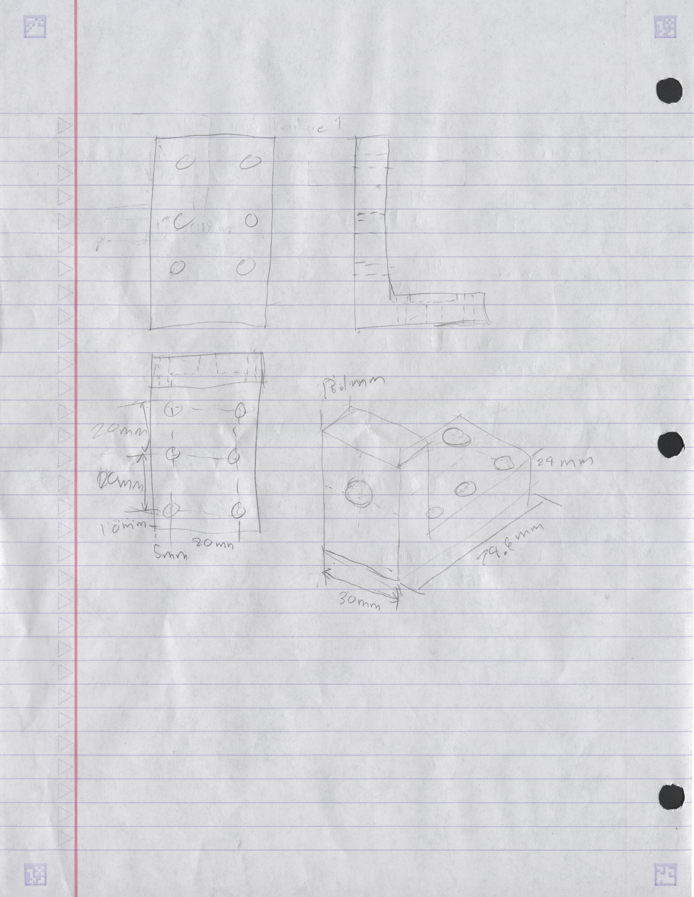

### CAD Model

Before creating any sketches, I first made the material of the mount according to the material properties sheet provided by SpecialChem. I opted to only include the properties listed by SpecialChem and not assign values to the rest.

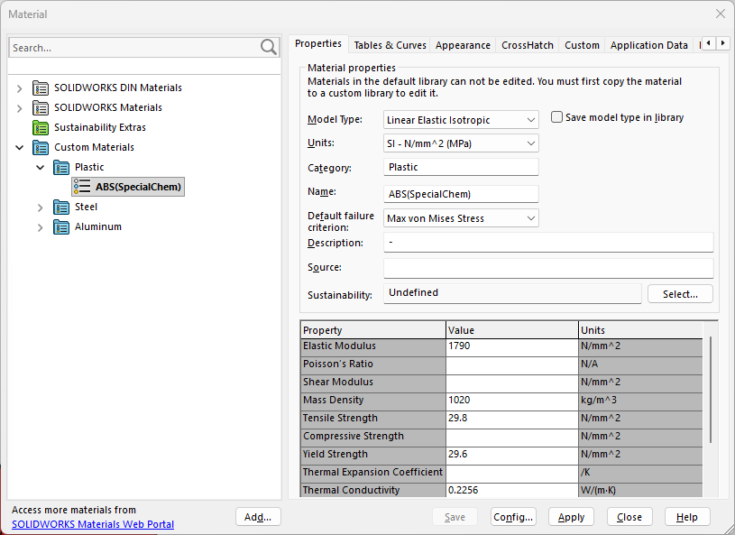

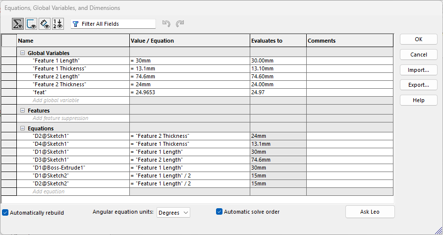

Then I created global variables for all the measurements I set in the final sketch of the motor mount. Before creating the sketch of the side profile of the mount.

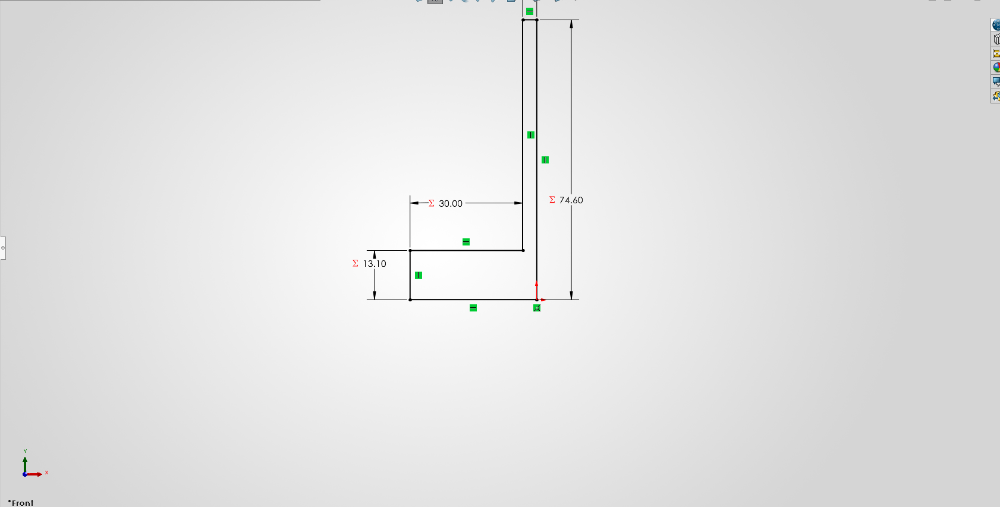

I dimensioned the sketch with respect to each feature's measurements using the global variables I created. Then I extruded the mount and dimensioned it using the length of feature 1.

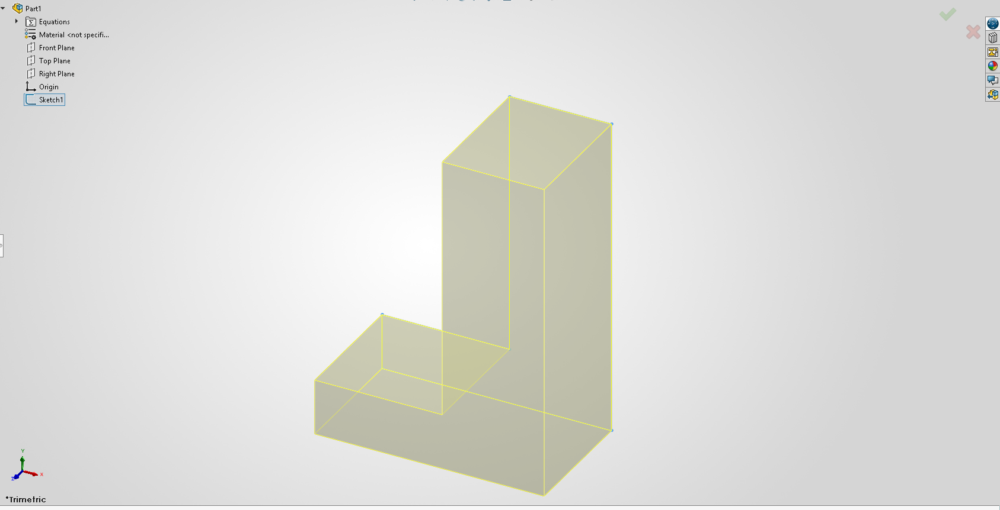

After extruding the side profile of the mount. I created the hole for the front face of the motor with a counterbore for the 2mm offset and a hole sized to 6.5mm for the shaft of the motor.

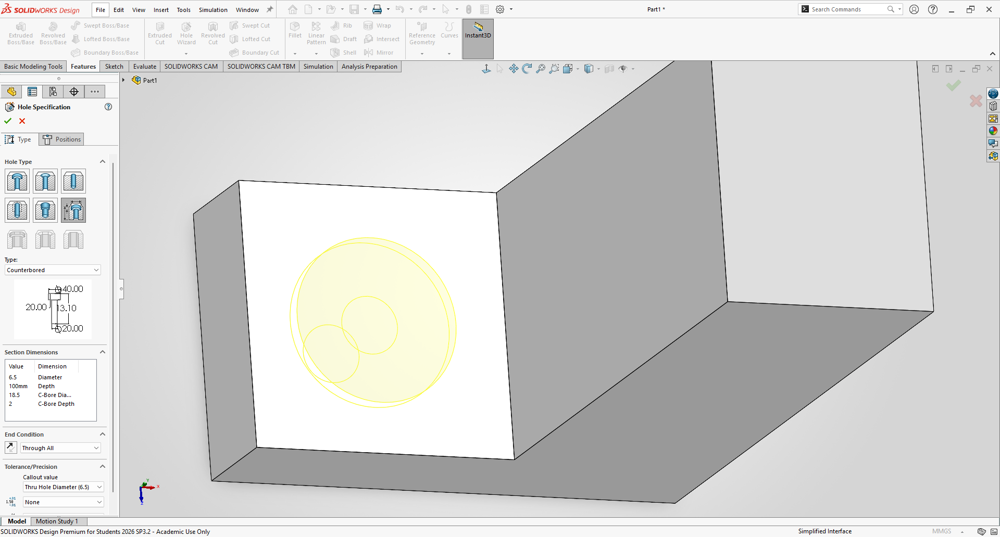

Afterwards, I created the holes to attach the face of the motor to the mount. First, I created the hole and set its diameter to 3.4mm according to the instructions for the assignment. All holes are created as thru all.

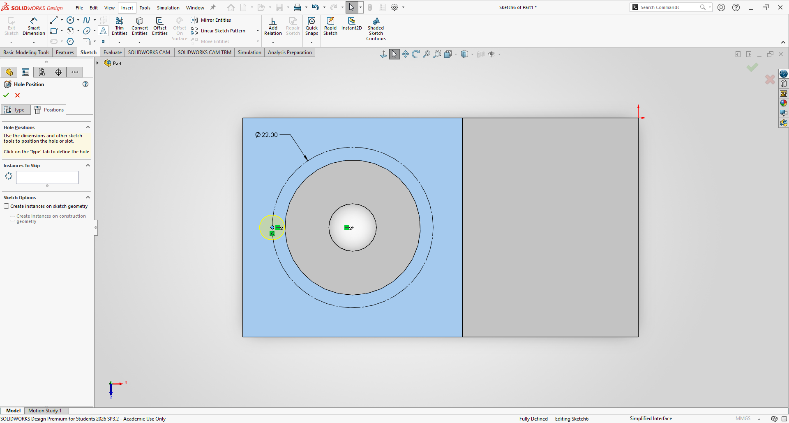

Then I created a sketch of a circle around the hole of the shaft and set its diameter to 22mm. Afterwards, I patterned the hole around the sketch.

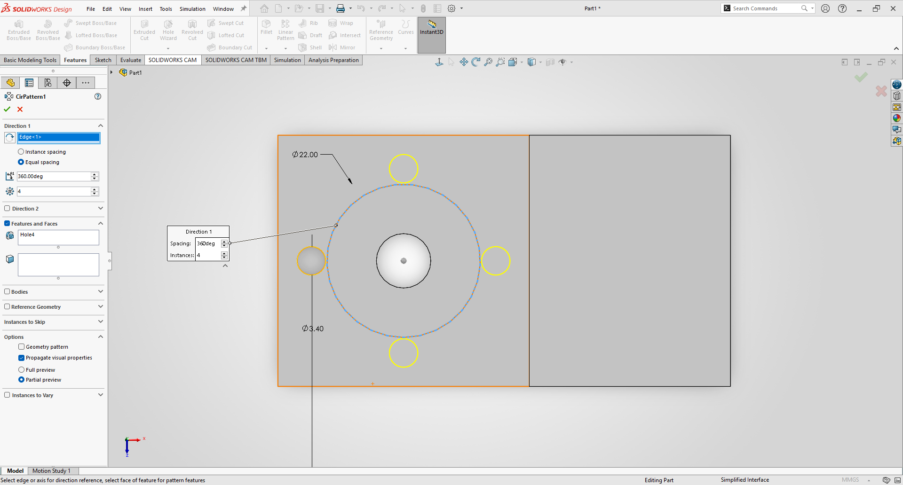

The same dimensions and procedure were used to create the holes on feature 2. The patterning of the holes was set to the dimensions on the final sketch.

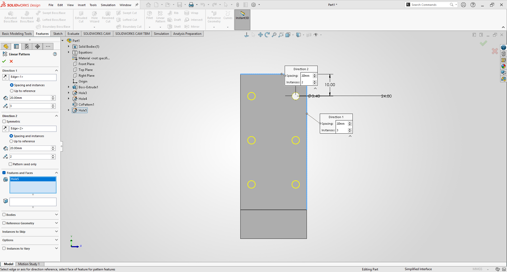

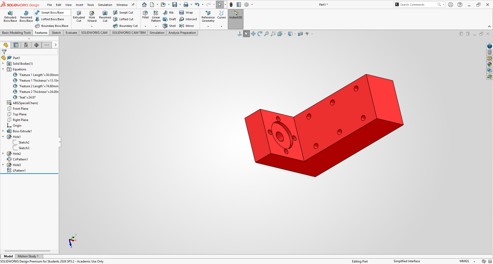

### Drawing

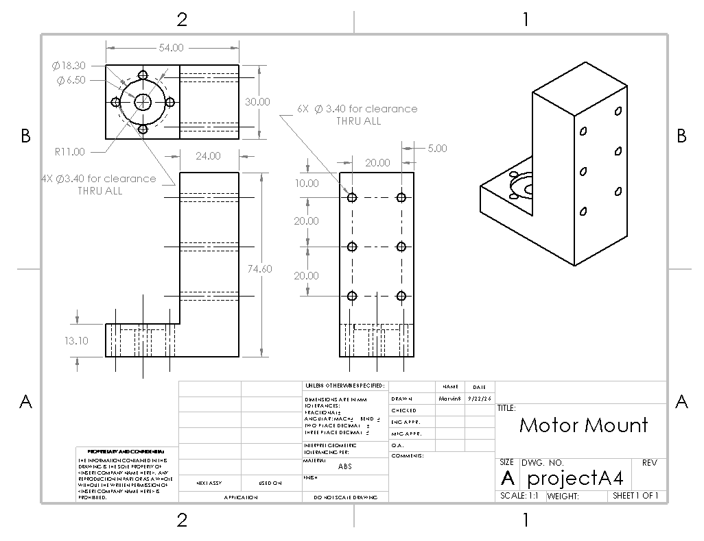

## Decide

### Feature 1
The choice to keep the length of the mount to 30mm was made so that the motor could be properly attached to the mount with 1mm clearance around the mount. The thickness of feature 1 was set to 13.1mm was to minimize deflection of the feature to 0.00030mm and handle the yield strength of ABS. The 2mm counterbore was made so that the face of the motor could attach flush to the mount. The size of the hole of the shaft was set to 6.5 mm, and the size of the offset was set to 18.3mm to have a clearance fit for the shaft and the offset. No dimensions were given regarding the spacing of the holes; I assumed that the holes were equally spaced and spaced the holes the same on feature 1.

### Feature 2
The choice to make the length of feature 2 74.6mm was to keep it uniform to the dimensions of the mount to the motor. The thickness of feature 2 was set to 24.0mm for the same reasons as feature 1 to minimize deflection and handle the yield strength of ABS. The choice to make the holes the same size as feature 1 was to maintain consistency for the hardware of the mount. The choice to have 6 holes in feature 2 was to compensate for the length of feature 2 and increase the clamping force of the motor mount to the wall. The spacing of the pattern was done to keep uniformity of the pattern of the bolts.

## Communicate

This project taught me that plastics can handle loads, but have lower stiffness compared to metals. Trying to accurately calculate the stresses and deflections of parts requires a lot of assumptions and knowledge on how to accurately model the part beforehand. The decision on how bolts should be patterned is something that I never had to consider before this project, but is something that would require more thought if the loads were significantly larger. Overall, this project took me around 18 hours total.

#### Links to articles used:

  Material properties taken from:
https://www.specialchem.com/plastics/guide/acrylonitrile-butadiene-styrene-abs-plastic

  Designing motor mounts article:
https://www.automate.org/motion-control/tech-papers/design-considerations-for-gearmotor-applications

  Designing 3d printed mounts article:
https://www.tinkercad.com/things/avvN77l4yc1-tt-gear-motor-mount

