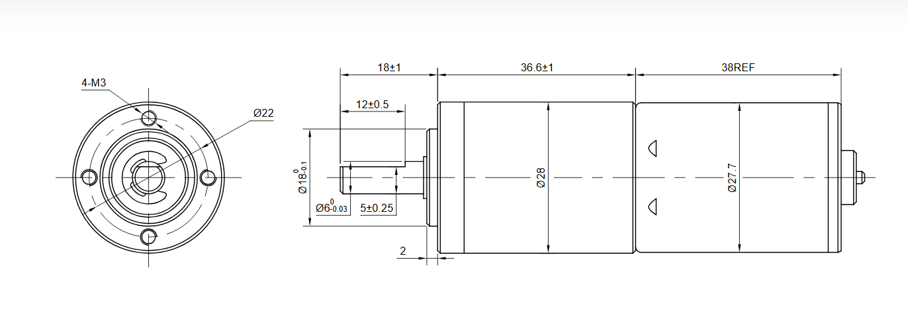
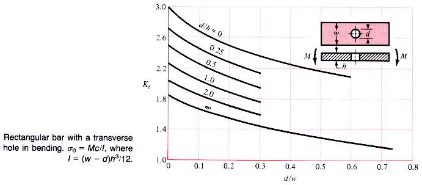
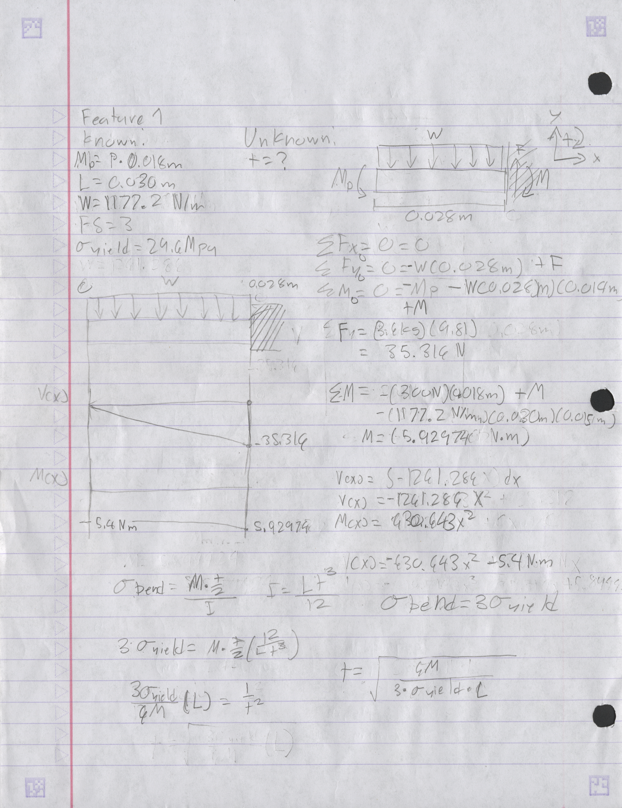
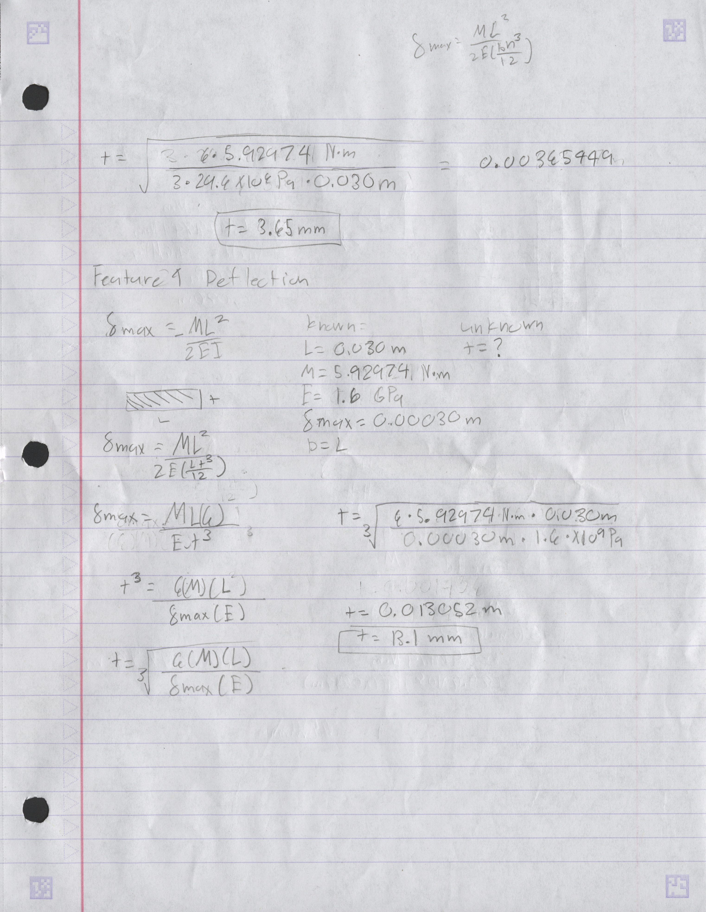
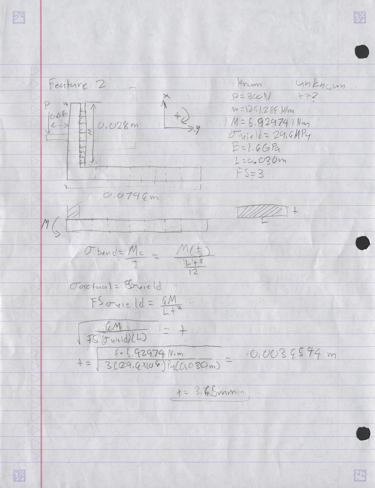

# A4 – [Topic]

## Objective

## Analyze

### Research
Before designing this part, I did some initial research into what design considerations I should have when designing motor mounts by looking at the article linked at the bottom of the page. Looking at all the references and the materials we could make this part from, I also looked at an article about designing 3d printed motor mounts specifically. The article is linked below. In order to make the model more accurate, I ignored the instruction to ignore the mass of the motor and calculated all values with the mass of the motor. I modeled the mass of the motor as a distributed load the size of its largest diameter given from the drawing provided by the website. I chose ABS as my material for the mount.

In my initial sketch of the design, I decided that the mount would be 30mm wide and calculated for the thickness of the part in all stress and deflection calculations. For all calculations, a factor of safety of 3 was used. 

### Feature 1

My first calculations were done to find the thickness with respect to the yield strength of ABS. As a challenge, I decided to try to accurately determine the thickness of feature 1 by treating the feature as a rectangular plate with a transverse hole in it. I used the chart below to find the stress concentration factor. The size of the hole was set to 18.3mm.

Then I calculated the thickness of feature 1 to minimize the deflection to a minimum of 0.00030mm.

Because the thickness of feature 1 that minimizes deflection is larger than the thickness that can handle the yield strength of the part. The final thickness of the part was set to be 13.1 mm.

### Feature 2

When calculating the thickness of the part with respect to yield strength, feature 2 was modeled as a cantilever beam with a moment on the end. The same 30 mm width of the part was used in all calculations.

![])()

For the sake of the assignment and my time, I decided to calculate deflections without considering the holes put into the design. 

used this for calculating bending stress:
https://mechanicalc.com/calculators/stress-concentration/

Material properties taken from:
https://www.specialchem.com/plastics/guide/acrylonitrile-butadiene-styrene-abs-plastic

then hand calculated maximum stress using 
## Decide

## Communicate

#### Links to articles used:
  Designing motor mounts article:
https://www.automate.org/motion-control/tech-papers/design-considerations-for-gearmotor-applications
  Designing 3d printed mounts article:
https://www.tinkercad.com/things/avvN77l4yc1-tt-gear-motor-mount

